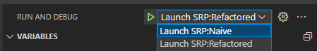

# Overview
This repository contains information about the 5 design principles covered by SOLID. This includes code examples with before (naive) and after (refactored) implementations when applying the principles.

### In Progress/Improvements:
- Add Open Close principle implementation
- Add Liskov's Substitution principle implementation
- Add Interface Segregation principle implementation
- Add Dependency Inversion principle implementation

- Add unit testing? (worth it for this?)

## Working with Examples
### Setup
1. Clone repository
2. Navigate to repository root in terminal/console
3. Install dependencies
		- If using npm: ```npm i```
		- If using yarn: ```yarn```

The package dependencies will be installed and at that point the code can be executed and debugged. See the [Executing Examples](#executing-examples) section for information on how to run the code samples.

## File Organization
### Source Code
Each principle has been broken down into their own folders. Within each of those are a naive and a refactored implementation. The idea is that we start with the naive implementation and through application of the principle, we end up with the refactored version. Additionally, the refactored code for a principle becomes the naive implementation on the next principle as they all build off each other. That said, if you want to view a specific principle, you should have the same before/after by looking at the naive and refactored versions of the principle.

### Documentation
Similar to the source code, the documenation has been broken up into a file for each principle. Each file describes the principle in question as well as why and how the naive version breaks the principle. There is limited discussion over why the changes between naive and refactored were made as well but comparing the different code implementations is the best way to view the changes.

## Executing Examples
### Running the principles
The package.json file in the root directory contains scripts for executing each version of each principle. This simply executes the script and outputs everything to the terminal. Below is an example of executing the Single Responsibility Principle's refactored implementation:

```npm run srp:refactored```

To view all available commands, please look at the [scripts](./package.json) section of

### Debugging the principles
There are debugger launch configurations defined for each version (naive and refactored) of each principle. To debug simply select the principle and version you want to step through, add any breakpoints, and run the debugger.



To launch a specific debugger:
1. open the Run and Debug panel
2. Select the principle and version launch configuration at the top
3. Click "Start Debugging" (F5)
