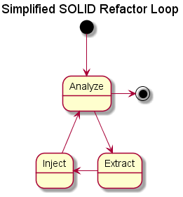
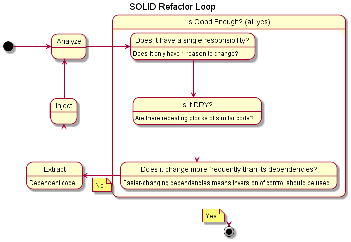

# SOLID Process

At it's most basic, the application of SOLID principles is a simple iterative approach where changes are made and then analysis is run to determine if more changes are needed.

That's fine and good but what does Analyze actually mean in this context? Expanding the diagram above we can see that the analysis asks a number of questions about the code with the ideal end result being able to reply affirmatively to each question.

## Analyze
The analysis step is really the starting point when going through the process of implementing clean code. Whether the code is legacy and needs updates/maintenance or the work is a fresh repository, the analysis stage will identify areas in the code which could be cleaned up, simplified, or removal of duplicated code.

The first question which should be asked is whether things are "good enough" for the given situation. What this means isn't to take shortcuts but rather ensure the amount of effort being put into the design or refactoring doesn't reach diminishing returns. If the code is a simple utility which does one thing and ther is unlikely to ever be a change to that, go ahead and stop. The gains of over-engineering a solution to something diminish based on expected usage and importance.

Now that the decision to continue the refactor/design, there are three main questions which should all resolve to "Yes" before we're finished.

### Does the class have a single reason to change?
The first principle of SOLID is Single Responsibility Principle which asks just this question. Does a class have a single reason to change? If, during analysis, there are a number of places which could potentially change more frequently the consuming class, it is worth extracting that code and instead inject the functionality into the class thus allowing modification of implementation without the need for code changes outside the single reason given above.
### Is the code DRY ("don't repeat yourself")?
### Do the class's dependencies change faster than it does?

## Extract

## Inject
