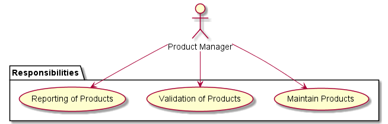
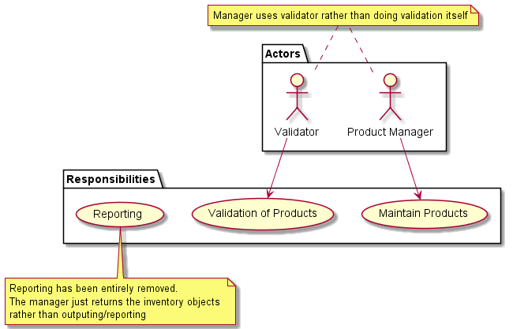

# Single Responsibility Principle (SRP)

The SRP outlines where to draw complexity lines with regards to implementation design. It is meant to limit how much responsibility any given block of code or component has since the greater the complexity and set of responsibilities, the harder the code is to maintain, the greater the risk of bugs, and the harder (sometimes impossible) unit testing.

### Definition
> A class should have 1 and only 1 reason to change

It's important to abstract the concept of a responsibility from the code itself. For example, SRP doesn't mean a class can only do one single thing but rather the overall collection of the class's functionality is cohesive around a single responsibility. As long as the only reason to change the class is a change to the class's domain, it's still following SRP.

To demonstrate this principle's violations, let's take a look at the naive implementation of the [product manager](../1_single_responsibility/naive/product_manager.ts) as it has multiple responsibilities outlined below but first what is the actual responsibility we want in the manager?

### True Responsibility:

The product manager's only responsiblity is to maintain a collection of products. Full-stop.

All products are added and updated through the manager with an encapsulated collection. This means the manager's domain of responsibility is the storage of products it is told to hold. It doesn't care about the products themselves, what prices they have, if they need to be unique, etc...just that it is storing what it is told to and can report the contents of the collection.

### Naive Implementation

#### Overview
The naive implementation of the product manager demonstrates code which works fine but breaks the Single Responsibility Principle by attempting to cover too many things. Below is what the true responsibility of the manager should be, what responsibilities the naive implementation has, and why those responsibilities aren't conducive to maintainable code.

<ul>

<li style="background-color: #333; color:#DDDD00">
Responsibility 1: Maintain collection of products. This means holding the product catalog information and adding to it when told.
</li>

<li style="background-color: #333; color:darkorange">
Responsibility 2: Validation. Right now the manager not only maintains the collection of products but it is also responsible for validating the products before adding them to the catalog. If any validation rules are added, removed, or changed, the manager would need to be updated. The validation is tangential to maintaining the collection of products.
</li>

<li style="background-color: #333; color:#FF5555">
Responsibility 3: Reporting. The manager currently reports any validation issues, which validation issues, as well as listing products. This is a break of SRP and an additional responsibility because any change to the reporting would require a change to the manager.
</li>
</ul>

As shown above, there are at least 3 distinct responsibilities. The reason why they are distinct is because of the way they would need to change based on external factors. This means the manager would need to be modified if the validations changed despite the fact the manager doesn't really care. The only reason the manager should need to change is if the underlying collection has domain requirement changes.

New business validation requirements should not mean the inventory manager needs to care. It simply holds what it's told to. This is the second responsibility being added to the manager.

Additionally, the manager cares which validation errors take place with this implementation. A real-life example is a warehouse not caring if the products being stored there are priced correctly. The warehouse just holds or releases what it is told. A misnamed or priced item is none of its business and the naive implementation forces this 3rd responsibility

### Refactored Implementation

#####  Removing Validation Responsibility
By offloading the responsibility of validation to a separate object, the manager removes that responsibility entirely. While the manager still depends on the validator, the validator maintains the rules and execution logic. In other words, business rule changes around validation can happen without having to update the manager.

##### Removing Reporting Responsibility
By offloading the responsibility of validation to a separate object, the manager removes that responsibility entirely. While the manager still depends on the validator, the validator maintains the rules and execution logic. In other words, business rule changes around validation can happen without having to update the manager.
