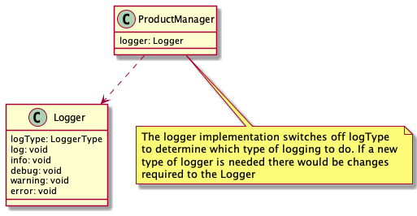
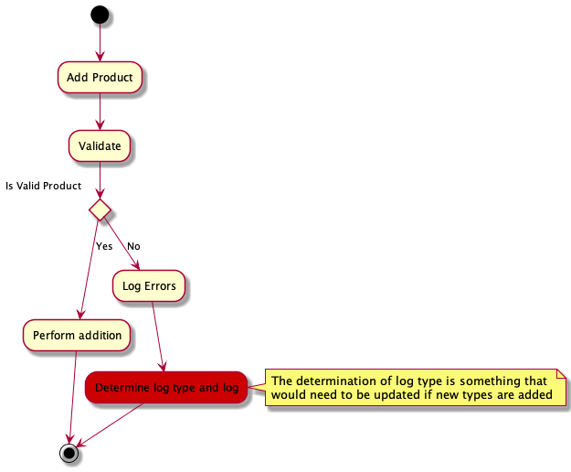
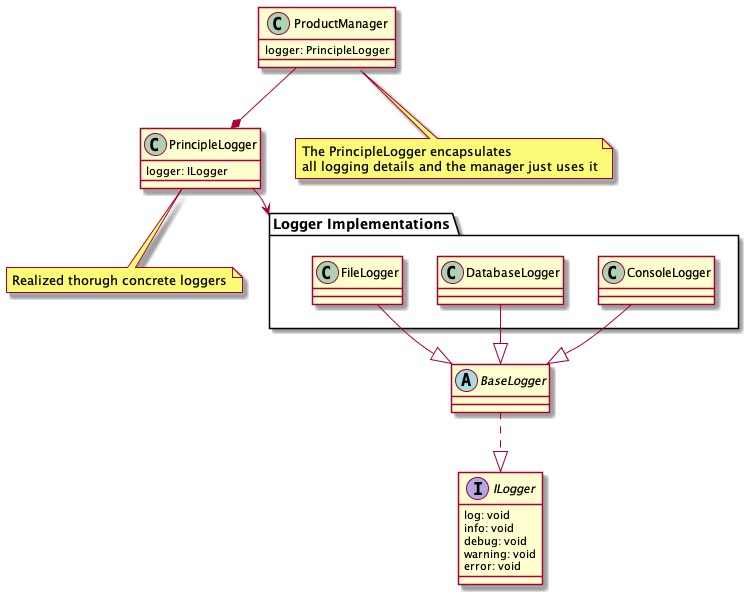
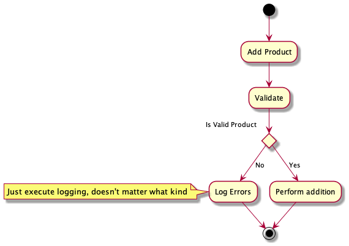

<!-- Principle's Name -->
# Open/Close Principle (OCP)

<!-- Add principle overview and why it matters -->
The Open/Close Principle defines what kind modifications are needed when new types or features are added. A common example is a class which uses a switch statement to determine the execution path. The reason why this breaks OCP is that if a new switch case is needed, you would have to modify the class. Therefore although the class can be extended, it can't be done so without modification to the core object.

### Definition
> A class should be open for extension but closed for modification

The idea isn't that the class can no longer be modified as there could be a bug that needs fixing. It's that it should be able to be extended *without* modification. This is beneficial because existing use cases aren't going to break with additional functionality being added. From a maintenance perspective, this means lowered testing effort as well as increasing reusability and flexibility.

### Naive Implementation
Starting with the refactored version of SRP, the developer was tasked with allowing multiple logging types/targets. Rather than only having console logging there is a need for file and/or database logging as well.

To solve for this business direction, the naive implementation creates a logger which can be given a type of log at the moment of creation. The logger then checks this type when a log request comes in and executes the logging to the target log type.

Below is the workflow step which breaks the principle highlighted in red. Since the logger itself determines where to log we are violating the OCP as we would not be able to extend this without modification

#### Overview
While the naive implementation does what was asked, it does so in a way that requires additional maintenance and testing moving forward. By refactoring the example to be open for extension but closed for modification we need to make it so that we can extend the logger (e.g. add additional logging types) without having to alter the class code.

### Refactored Implementation
The refactor of the logging to conform to OCP focuses primarily on how logging is handled and making it more extensible and flexible. As you can see in the diagram below, we've effectively decoupled the logging implementation from the ProductManager.

As can be seen below, the ProductManager no longer is responsible for logging and how that is done, the PrincipleLogger is extensible without modification, and those changes combined streamline the workflow.

##### Refactor Note 1
We are now passing in the logging implementation when creating the logger. By allowing the injection of the actual implementation, we can now add additional logging types without changing the main class. Hence, the logger is open to extension (by injecting new functionality) but closed for modification (there is no need to modify the code)

##### Refactor Note 2
It's worth noting that we're still breaking some principles here as we are working primarily with concrete classes rather than relying more heavily on abstractions. As we continue working through the principles we will clean that up. The concrete PrincipleLogger class encapsulates all logging functionality but we will eventually want to replace with abstractions
