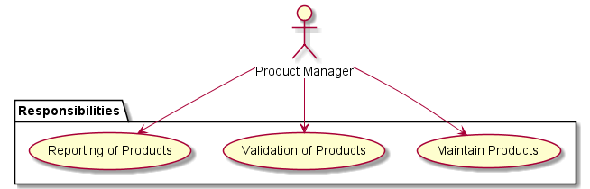

<!-- Principle's Name -->
#Interface Segregation Principle (ISP)

<!-- Add principle overview and why it matters -->
Lorem ipsum...

###Definition
<!-- add principle definition -->
> (description)

<!-- Add details/overview of principle -->
Lorem ipsum....

### Naive Implementation
Add naive implementation diagram if applicable
<!--  -->

####Overview
Lorem ipsum... (add naive implementation details)

### Refactored Implementation

Add refactored implementation diagram if applicable
<!--  -->

#####Refactor Note 1
Lorem ipsum...

#####Refactor Note 2
Lorem ipsum...
